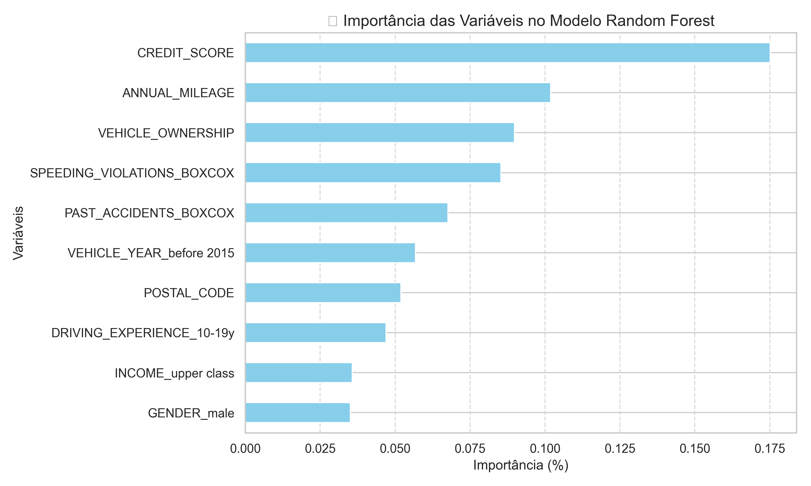
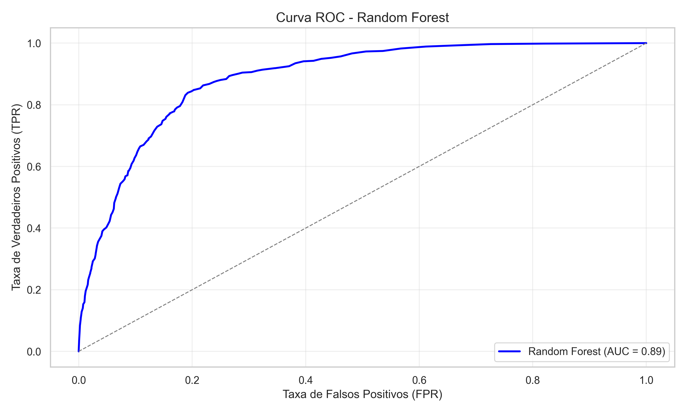

# 📂 Pasta `visuals/`

Este diretório contém os gráficos e visualizações gerados durante o projeto **Previsão de Sinistros de Seguro de Carro**. Esses arquivos são utilizados para ilustrar e explicar os resultados obtidos nas etapas de análise exploratória e modelagem.

---

## 📋 Conteúdo

### 1. `feature_importance.png`
- **Descrição**: Gráfico que exibe a importância das variáveis para o modelo Random Forest.
- **Finalidade**: Destacar as variáveis mais relevantes para a previsão do acionamento do seguro.
- **Exemplo**:
  - Variável mais importante: `CREDIT_SCORE` (17.51%).

---

### 2. `roc_curve.png`
- **Descrição**: Curva ROC (Receiver Operating Characteristic) gerada para o modelo final.
- **Finalidade**: Avaliar a capacidade do modelo de distinguir entre as classes (acionamento ou não do seguro).
- **Métrica**:
  - Área sob a curva (AUC-ROC): **88.69%**.

---

## 📊 Como Utilizar os Arquivos

- Os gráficos podem ser incluídos em relatórios ou apresentações para demonstrar os resultados do projeto.
- Eles também são exibidos na aplicação interativa construída com **Streamlit**, localizada na pasta `app/`.

---

## 🖼️ Prévia dos Gráficos

### 📈 Importância das Variáveis
- Mostra as variáveis que mais influenciam o modelo de previsão:
  

### 📉 Curva ROC
- Mede a capacidade do modelo em distinguir entre classes:
  

---

## 📦 Estrutura da Pasta

```plaintext
visuals/
├── feature_importance.png  # Importância das variáveis para o modelo
├── roc_curve.png           # Curva ROC do modelo final
